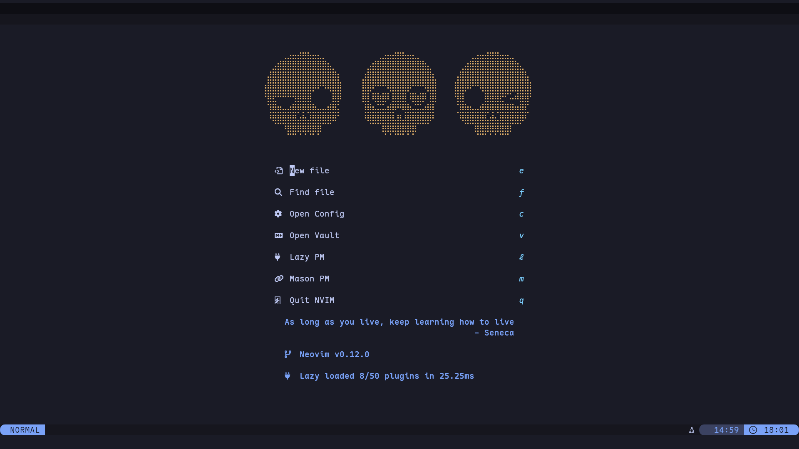
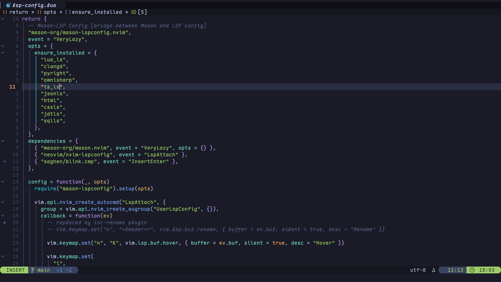
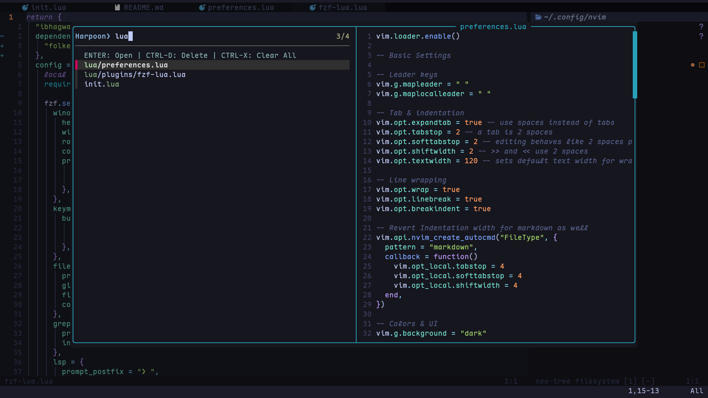

# My Neovim dotfiles

My Neovim configuration built with Lua, and the help of [typecraft's](https://youtube.com/playlist?list=PLsz00TDipIffreIaUNk64KxTIkQaGguqn&si=lKSghpiI4RgrFCxg) youtube playlist, [kickstart](https://github.com/nvim-lua/kickstart.nvim) nvim and me myself.

---

## In The [Beninging](https://www.youtube.com/watch?v=vacJSHN4ZmY)

**Prerequisites**: I started with Neovim 0.11.x and with [Nerd Fonts](https://www.nerdfonts.com/) too (I personally use [Maple Font NF](https://github.com/subframe7536/maple-font) btw if you care)

**Installation**:

```bash
git clone https://github.com/singhantariksh/nvim-dotfiles.git ~/.config/nvim
cd ~/.config/nvim
nvim
```

open neovim and everything should be installed automatically (hopefully)

---

## Configuration Structure

```tree
~/.config/nvim/
├── assets
│   ├── editor.png
│   ├── greeter.png
│   └── navigation.png
├── init.lua
├── lazy-lock.json
├── lua
│   ├── plugins
│   │   ├── alpha-greeter.lua
│   │   ├── autopairs.lua
│   │   ├── auto-session.lua
│   │   ├── blink-cmp.lua
│   │   ├── bufferline.lua
│   │   ├── comments.lua
│   │   ├── conform.lua
│   │   ├── flash.lua
│   │   ├── fzf-lua.lua
│   │   ├── git.lua
│   │   ├── harpoon.lua
│   │   ├── lsp-config.lua
│   │   ├── lualine.lua
│   │   ├── mini-modules.lua
│   │   ├── neotree.lua
│   │   ├── render-markdown.lua
│   │   ├── smooth-cursor.lua
│   │   ├── snacks.lua
│   │   ├── terminal.lua
│   │   ├── themes.lua
│   │   ├── todo.lua
│   │   ├── treesitter.lua
│   │   ├── undotree.lua
│   │   └── which-key.lua
│   ├── plugins.lua
│   └── preferences.lua
└── README.md
```

---

## Some Screenshots

### Startup Screen



### Editing Experience



### Navigation with fzf-lua (Harpoon integration)



---

```

```
