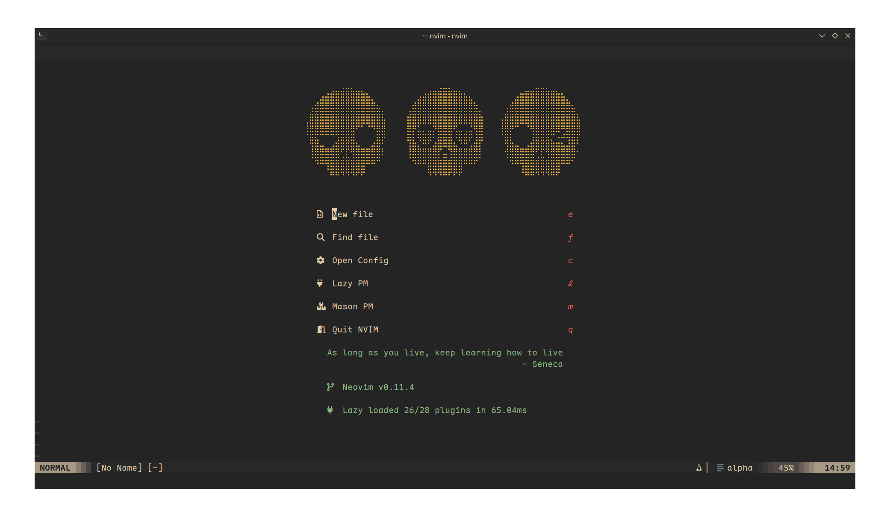
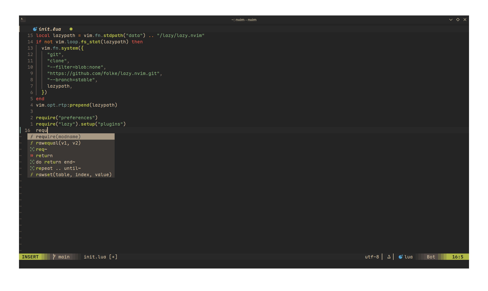
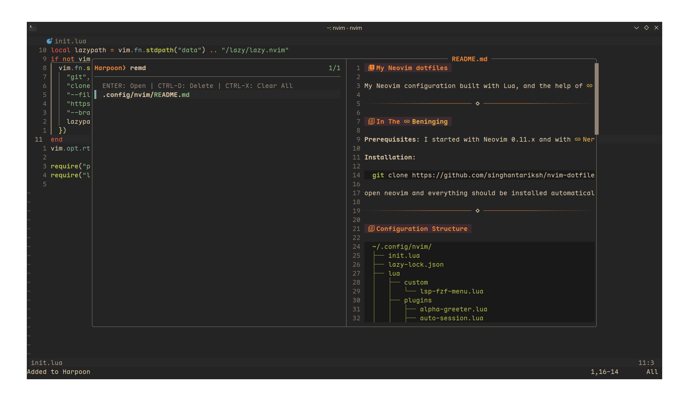

# My Neovim dotfiles

My Neovim configuration built with Lua, and the help of [typecraft's](https://youtube.com/playlist?list=PLsz00TDipIffreIaUNk64KxTIkQaGguqn&si=lKSghpiI4RgrFCxg) youtube playlist, [kickstart](https://github.com/nvim-lua/kickstart.nvim) nvim and me myself.

---

## In The [Beninging](https://www.youtube.com/watch?v=vacJSHN4ZmY)

**Prerequisites**: I started with Neovim 0.11.x and with [Nerd Fonts](https://www.nerdfonts.com/) too (I personally use [Maple Font NF](https://github.com/subframe7536/maple-font) btw if you care)

**Installation**:

```bash
git clone https://github.com/singhantariksh/nvim-dotfiles.git ~/.config/nvim
```

open neovim and everything should be installed automatically (hopefully)

---

## Configuration Structure

```tree
~/.config/nvim/
├── init.lua
├── lazy-lock.json
├── lua
│   ├── custom
│   │   └── lsp-fzf-menu.lua
│   ├── plugins
│   │   ├── alpha-greeter.lua
│   │   ├── auto-session.lua
│   │   ├── blink-cmp.lua
│   │   ├── bufferline.lua
│   │   ├── comments.lua
│   │   ├── conform.lua
│   │   ├── fzf-lua.lua
│   │   ├── git.lua
│   │   ├── harpoon.lua
│   │   ├── indent-line.lua
│   │   ├── lsp-config.lua
│   │   ├── lualine.lua
│   │   ├── neotree.lua
│   │   ├── terminal.lua
│   │   ├── themes.lua
│   │   ├── todo.lua
│   │   ├── treesitter.lua
│   │   ├── undotree.lua
│   │   └── which-key.lua
│   ├── plugins.lua
│   └── preferences.lua
└── README.md
```

---

## Some Screenshots

### Startup Screen



### Editing Experience



### Navigation with fzf-lua (Harpoon integration)



---

## What does this offer you ask ?

### Mr. Manager

-   **[Lazy.nvim](https://github.com/folke/lazy.nvim)** [`init.lua`](./init.lua): It's called lazy but it's FAST. (because it can lazy load stuff)

### UI UX

-   **[Gruvbox Material](https://github.com/sainnhe/gruvbox-material)** [`themes.lua`](./lua/plugins/themes.lua): I'm a gruvbox enjoyer.
-   **[Alpha-nvim](https://github.com/goolord/alpha-nvim)** [`alpha-greeter.lua`](./lua/plugins/alpha-greeter.lua): A nice greeter with quick actions too!
-   **[Lualine](https://github.com/nvim-lualine/lualine.nvim)** [`lualine.lua`](./lua/plugins/lualine.lua): A statusline showing mode, file info, git status, diagnostics and more.
-   **[Bufferline](https://github.com/akinsho/bufferline.nvim)** [`bufferline.lua`](./lua/plugins/bufferline.lua): Buffer tabs for easy visualization between opened buffers.
-   **[Indent Blankline](https://github.com/lukas-reineke/indent-blankline.nvim)** [`indent-line.lua`](./lua/plugins/indent-line.lua): Visual indentation guides. (don't go over indentation lines in input mode lol)
-   **[Markview](https://github.com/iamcco/markdown-preview.nvim)** [`markview.lua`](./lua/plugins/markview.lua): Preview markdown files directly in Neovim. (much of this plugin was developed on a mobile phone by OXY2DEV :o)

    > **Note:** I customized Markview and Prettier for my workflow. See [Some Tweaks for Markview](#some-tweaks-for-markview) for details.

### LSP (& Stuff)

-   **[Mason](https://github.com/mason-org/mason.nvim)** [`lsp-config.lua`](./lua/plugins/lsp-config.lua): package manager for LSP servers, formatters, and linters.
-   **[Mason-LSPconfig](https://github.com/mason-org/mason-lspconfig.nvim)** [`lsp-config.lua`](./lua/plugins/lsp-config.lua): Bridge between Mason and LSPs.
-   **[nvim-lspconfig](https://github.com/neovim/nvim-lspconfig)** [`lsp-config.lua`](./lua/plugins/lsp-config.lua): Quickstart configs for Neovim's LSP.
-   **[Blink.cmp](https://github.com/saghen/blink.cmp)** [`blink-cmp.lua`](./lua/plugins/blink-cmp.lua): auto-completion engine with fuzzy (hehe) intelligence and snippet support.
-   **[friendly-snippets](https://github.com/rafamadriz/friendly-snippets)** [`blink-cmp.lua`](./lua/plugins/blink-cmp.lua): Snippet collection for various languages.

### Structural Integrity

-   **[Conform.nvim](https://github.com/stevearc/conform.nvim)** [`conform.lua`](./lua/plugins/conform.lua): Universal formatter which doesn't replace the whole buffer !!! :o
-   **[Treesitter](https://github.com/nvim-treesitter/nvim-treesitter)** [`treesitter.lua`](./lua/plugins/treesitter.lua): syntax highlighting and code parsing to understand code structure. (goated)
-   **[nvim-treesitter-textobjects](https://github.com/nvim-treesitter/nvim-treesitter-textobjects)** [`treesitter.lua`](./lua/plugins/treesitter.lua): Smart text objects and motions utilizing Treesitter.

### Instant Transmission

-   **[FzfLua](https://github.com/ibhagwan/fzf-lua)** [`fzf-lua.lua`](./lua/plugins/fzf-lua.lua): fuzzy finder for ... a whole lotta things.
-   **[Neo-tree](https://github.com/nvim-neo-tree/neo-tree.nvim)** [`neotree.lua`](./lua/plugins/neotree.lua): file explorer for viewing files haha.
-   **[Harpoon 2](https://github.com/ThePrimeagen/harpoon/tree/harpoon2)** [`harpoon.lua`](./lua/plugins/harpoon.lua): The name's Primegan.

#### Custom LSP Menu with FzfLua

**[Custom LSP FzfLua Menu](./lua/custom/lsp-fzf-menu.lua)**: Henceforth, one menu shall rule them all. Created for FzfLua LSP options that `lsp_finder` doth not cover (see ### LSP/Diagnostics in their README). Press `<leader>c`, behold the menu, select thy command, and it shall be executed forthwith. Verily, 'tis better than remembering keybinds for features used but thrice per annum. (Claude did the coding whilst I provided the vibe)

### Git

-   **[Gitsigns](https://github.com/lewis6991/gitsigns.nvim)** [`git.lua`](./lua/plugins/git.lua): I'll explain when I understand.

### QoL

-   **[ToggleTerm](https://github.com/akinsho/toggleterm.nvim)** [`terminal.lua`](./lua/plugins/terminal.lua): It toggles terminals. (my comments be like)
-   **[Comment.nvim](https://github.com/numToStr/Comment.nvim)** [`comments.lua`](./lua/plugins/comments.lua): Quick commenting. (so I don't have to remember the syntax of comments for a billion languages)
-   **[UndoTree](https://github.com/mbbill/undotree)** [`undotree.lua`](./lua/plugins/undotree.lua): The multiverse of Undos.
-   **[Which-Key](https://github.com/folke/which-key.nvim)** [`which-key.lua`](./lua/plugins/which-key.lua): For those who can't remember their keybinds. (me)
-   **[todo-comments.nvim](https://github.com/folke/todo-comments.nvim)** [`todo.lua`](./lua/plugins/todo.lua): Have too much shit to do but not too much time ? this is your friend. (if you use it)
-   **[auto-session](https://github.com/rmagatti/auto-session)** [`auto-session.lua`](./lua/plugins/auto-session.lua): remembers and reopens your files and windows (as a session). (particularly useful when constantly `:wqa`'ing to check if your plugins are working)

### Eye-Candy

- **[NeoScroll](https://github.com/karb94/neoscroll.nvim)** [`smooth-cursor.lua`](./lua/plugins/smooth-cursor.lua): Smooth Operator (Scrolling)
- **[Smear Cursor](https://github.com/sphamba/smear-cursor.nvim)** [`smooth-cursor.lua`](./lua/plugins/smooth-cursor.lua): Smooth Operator (Cursor) 

---

## Preferences

The [`preferences.lua`](lua/preferences.lua) file contains my ... preferences ?

I have tried (kinda) to make the file structure understandable so I don't have to update this readme for every minor change I make in my preferences :D

---

## Some Tweaks for Markview

Markview recommends `nowrap`, but I prefer `wrap`. Also, my default indentation width is 2, but I wanted 4 spaces for markdown files. To address both, I made these changes:

Add the following to your `preferences.lua`:

```lua
-- Set wrap and indentation specifically for markdown files
vim.api.nvim_create_autocmd("FileType", {
    pattern = "markdown",
    callback = function()
        vim.opt_local.wrap = false
        vim.opt_local.tabstop = 4
        vim.opt_local.softtabstop = 4
        vim.opt_local.shiftwidth = 4
    end,
})
```

To ensure Prettier formats markdown files with 4-space indentation (while keeping 2 for everything else, global change btw), create a `.prettierrc` in your home directory with:

```json
{
    "tabWidth": 2,
    "overrides": [
        {
            "files": "*.md",
            "options": {
                "tabWidth": 4
            }
        }
    ]
}
```

---

**Thanks!**

---

## TL;DR

I hate you.
