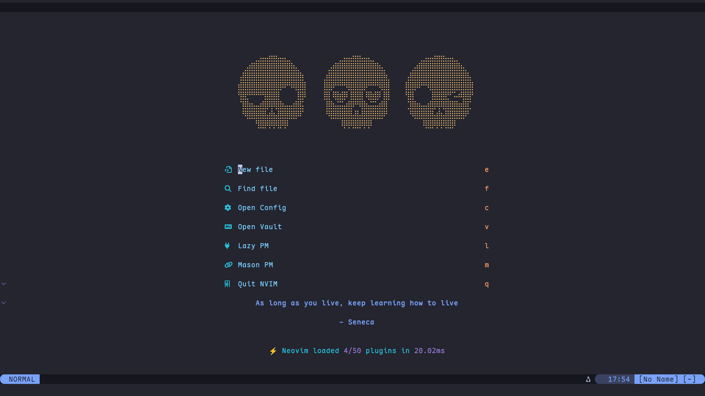
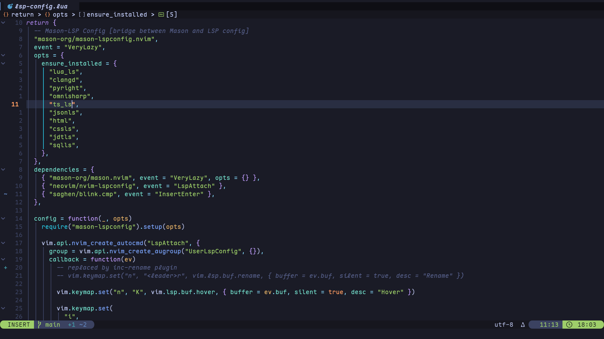
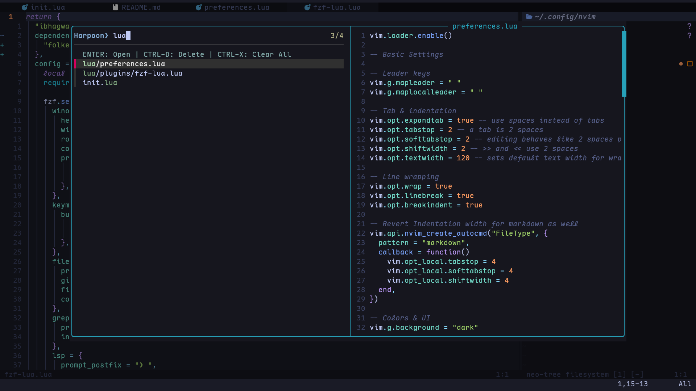
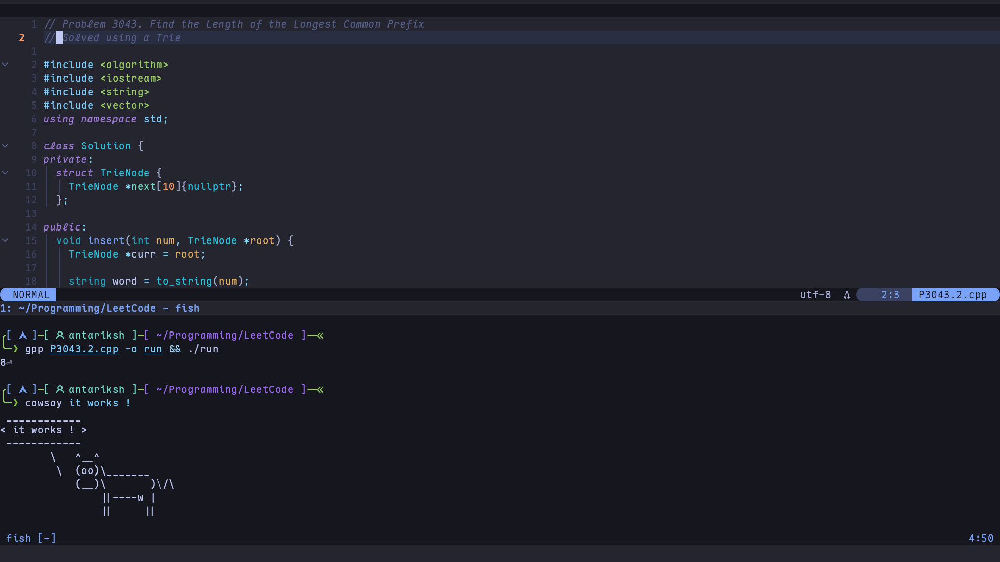

# My Neovim dotfiles

My Neovim configuration built with Lua, and the help of [typecraft's](https://youtube.com/playlist?list=PLsz00TDipIffreIaUNk64KxTIkQaGguqn&si=lKSghpiI4RgrFCxg) youtube playlist, [kickstart](https://github.com/nvim-lua/kickstart.nvim) nvim and me myself.

---

## In The [Beninging](https://www.youtube.com/watch?v=vacJSHN4ZmY)

**Prerequisites**: I'm on Neovim 0.12.x and with [Nerd Fonts](https://www.nerdfonts.com/) too (I personally use [Maple Font NF](https://github.com/subframe7536/maple-font) btw, [if you care])

**Installation**:

```bash
git clone https://github.com/singhantariksh/nvim-dotfiles.git ~/.config/nvim
cd ~/.config/nvim
nvim
```

open neovim and everything should be installed automatically (hopefully)

---

## Configuration Structure

```tree
.config/nvim
├── assets
│   ├── editor.png
│   ├── greeter.png
│   ├── navigation.png
│   └── terminal.png
├── init.lua
├── lazy-lock.json
├── lua
│   ├── keybinds.lua
│   ├── plugins
│   │   ├── editing
│   │   │   ├── auto-pairs.lua
│   │   │   ├── comments.lua
│   │   │   ├── flash.lua
│   │   │   ├── inc-rename.lua
│   │   │   ├── indent-o-matic.lua
│   │   │   ├── lorem.lua
│   │   │   ├── mini-modules.lua
│   │   │   ├── neogen.lua
│   │   │   ├── todo.lua
│   │   │   ├── ultra-fold.lua
│   │   │   ├── undo-tree.lua
│   │   │   └── vim-matchup.lua
│   │   ├── lsp-n-stuff
│   │   │   ├── blink-cmp.lua
│   │   │   ├── code-companion.lua
│   │   │   ├── conform.lua
│   │   │   ├── lazydev.lua
│   │   │   ├── lsp-config.lua
│   │   │   ├── luasnip.lua
│   │   │   └── treesitter.lua
│   │   ├── tools
│   │   │   ├── auto-session.lua
│   │   │   ├── color-picker.lua
│   │   │   ├── csv-view.lua
│   │   │   ├── fzf-lua.lua
│   │   │   ├── git.lua
│   │   │   ├── grug-far.lua
│   │   │   ├── harpoon.lua
│   │   │   ├── obsidian.lua
│   │   │   ├── snacks.lua
│   │   │   ├── suda.lua
│   │   │   ├── which-key.lua
│   │   │   └── yazi.lua
│   │   └── ui
│   │       ├── lualine.lua
│   │       ├── navic-winbar.lua
│   │       ├── render-markdown.lua
│   │       ├── showkeys.lua
│   │       ├── smooth-cursor.lua
│   │       └── tokyo-night.lua
│   ├── plugins.lua
│   ├── preferences.lua
│   └── snippets
│       └── cpp.lua
└── README.md
```

---

## Some Screenshots

### Startup Screen



### Editing Experience



### Navigation with fzf-lua (fuzzy search inside the current buffer)


### Custom Toggle-able Floating Terminal



---
